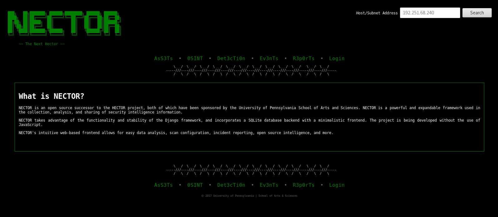

# NECTOR - by haX0rs for haX0rs



## About NECTOR

NECTOR is an open source successor to the HECTOR project, both of which have
been sponsored by the University of Pennsylvania School of Arts & Sciences.

The purpose of NECTOR is to increase security awareness among institutions
by demonstrating potential security vulnerabilities. NECTOR is a powerful and
expandable framework used in the collection, analysis, and sharing of security
intelligence information.

NECTOR takes advantage of the functionality and stability of the Django
framework, and incorporates a SQLite database backend with a minimalistic
frontend. The project is being developed without the use of JavaScript.

NECTOR's intuitive web-based frontend allows for easy data analysis, scan
configuration, incident reporting,  and more.


---


## Getting Started


### Setting up a Virtual Environment (Optional)

Create a [virtualenv](https://virtualenv.pypa.io/en/stable/) to work in, and
activate it.

```
$ virtualenv venv-nector
$ source venv-nector/bin/activate
```


### Trying the Demo (Optional)

If you want to try out the demo of NECTOR before making a full
commitment, run:

```
$ make demo
```

Then, open a browser and go to **http://127.0.0.1:8000**

If you like what you see, continue onto the next steps.


### Downloading Dependencies

Install [pip](https://pypi.python.org/pypi/pip) dependencies.

```
$ pip install -r requirements.txt
```


### Using Your Secret Key

Traverse into the nector/ subdirectory and open settings.py in a text editor.

```
$ vi nector/settings.py
```

Find the line

    SECRET_KEY = 'THISISTOPSECR3t,MAN!'

and replace it with your own Django secret key.

[Click here to obtain a Secret Key.](http://www.miniwebtool.com/django-secret-key-generator/)


### Initializing the Database

Django uses [migrations](https://docs.djangoproject.com/en/1.11/topics/migrations/)
to keep track of changes to the database's tables.

First, create new migrations based on the Django models of our project.

```
$ python manage.py makemigrations
```

Next, apply the migrations to our database (this will create a database if
one does not already exist). Doing this will fill our database with the tables
we need for the project.

```
$ python manage.py migrate
```


### Creating Your Data

#### Getting Hosts with Nmap

Create a file `subnets.txt` and fill it with your subnets.

```
$ vi subnets.txt
```

Use [nmap](https://nmap.org/) to run a scan on all the hosts in those subnets.
Save this scan as hosts.xml

```
$ nmap -sL -iL subnets.txt -oN hosts.xml
```

#### Getting Vulnerabilities with Nessus

Go into Nessus.

Under the _Analysis_ dropdown, select _Vulnerabilities_.

From the new dropdown box in the top left corner, select _Vulnerability List_.

In the top right corner, click on the _Options_ dropdown, and select
_Export as CSV_.

Make sure _only_ 'Plugin ID', 'Plugin Name', 'Severity', 'IP Address', and
 'DNS Name' are selected.

Click submit, and save this file as _vulnlist.csv_ in your NECTOR root directory.

#### Getting Events

Todo.

#### Getting Ports

Todo.

#### Filling in the Gaps

If you were unable to perform any of the above four steps, keep reading.
Otherwise, you should skip this step.

##### Missing Hosts, Vulnerabilities, or Events

Copy the sample data you need from `sample-data/` into this project's root folder.

```
$ cp sample-data/MISSING-FILE .
```

Remove the '_sample-_' prefix from the file(s).

```
$ mv sample-events.csv events.csv
$ mv sample-hosts.xml hosts.xml
$ mv sample-vulnlist.csv vulnlist.csv
```

Edit the file(s) to use your data.

Do not mess up the formatting!

##### Missing Ports

Rename the sample port files in `port-scans/` to remove the '_sample-_' prefix.

```
$ mv port-scans/sample-port-22-open-170502.csv port-scans/port-22-open-170502.csv
$ mv port-scans/sample-port-80-open-170509.txt port-scans/port-80-open-170509.txt
```

Edit the sample port files in `port-scans/`.

Do not mess up the formatting!


### Populating the Database

In order to use your data, you will have to import it into the database.

```
$ python import-data.py
$ python import-ports.py
```


### Running NECTOR


Start the server.

```
$ python manage.py runserver
```

Open a browser and go to **http://127.0.0.1:8000**


### Deactivating the Virtual Environment

If you set up a Virtual Environment, run `$ deactivate` once you're done
working on NECTOR.


### The Makefile

The makefile exists to automate making migrations and importing
data.

If you make frequent changes to NECTOR (which is expected), you will
want to run `$ make` to take care of everything for you.

    Note: The makefile will not activate or deactivate your virtualenv.
    If you plan on using one, you must do so manually.


---


## Misc. Notes

Let's try to stick with Python2 for now.

This is the main NECTOR project repo.

We'll be adding small applications to this project over time.

Applications:

- hosts (subnets)
- detection
- osint
- events
- reports


## Events

TODO: Add more to this section.

- An event is an observed change to the normal behavior of a system, environment, process, workflow or person. Examples: router ACLs were updated, firewall policy was pushed.
- An alert is a notification that a particular event (or series of events) has occurred, which is sent to responsible parties for the purpose of spawning action. Examples: the events above sent to on-call personnel.
- An incident is a human-caused, malicious event that leads to (or may lead to) a significant disruption of business. Examples: attacker posts company credentials online, attacker steals customer credit card database, worm spreading through network.*
